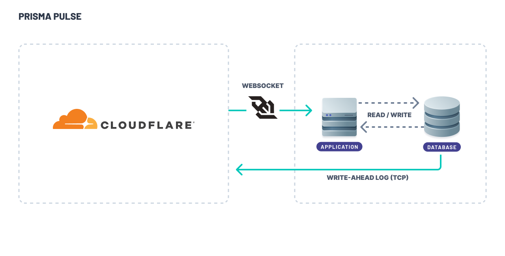

<TopBlock>

[Pulse](https://www.prisma.io/data-platform/pulse) is a managed [change data capture (CDC)](https://en.wikipedia.org/wiki/Change_data_capture) service that captures change events from your database and delivers them instantly to your applications. With Pulse, you can quickly build real-time applications in a type-safe manner using [Prisma Client](/orm/prisma-client).

</TopBlock>

## Example projects

Here are a few example projects using Prisma Pulse:

| Project                                                          | Description                                                                                                                                                     |
| ---------------------------------------------------------------- | --------------------------------------------------------------------------------------------------------------------------------------------------------------- |
| [pulse-starter](https://github.com/prisma/pulse-starter)         | This is a Prisma Pulse starter project.                                                                                                                         |
| [pulse-chat-mono](https://github.com/prisma/pulse-chat-mono)     | Simple chat application using Pulse.                                                                                            |
| [pulse-resend-demo](https://github.com/prisma/pulse-resend-demo) | This project uses Prisma Pulse to monitor new user additions to a database. Upon detection, it triggers the Resend API to send an email to the respective user. |
