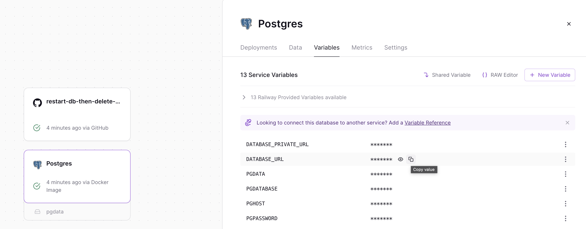

<TopBlock>

[Railway.app](https://railway.app) offers an excellent [templates feature](https://railway.app/templates). If you wish to quickly start with Prisma Pulse, you can use either of two templates:

- [Prisma Pulse DB Only](https://railway.app/template/pulse-pg): Provides a fresh, pre-configured PostgreSQL database which you can use with Prisma Pulse.
- [Prisma Pulse DB & App](https://railway.app/template/pulse-starter): Provides a pre-configured PostgreSQL database and a [Prisma Pulse starter app](https://github.com/prisma/pulse-starter).

</TopBlock>

## Setup using the template

<br />

1. Deploy the [template](https://railway.app/template/pulse-pg) on Railway

2. Click on the service called `restart-db-then-delete-me`.

3. You will see a list of deployments under the **Deployments** tab.

4. Click the most recent build's **View Logs** button.

5. Click on the **Deploy Logs** tab. If the service ran correctly, you should see a message in the logs that says "All done please restart the database" along with your `DATABASE_URL` connection string.

   > **Note**:
   > The `DATABASE_URL` can also be found by clicking on the **Postgres** Service and navigating to the **Variables** tab, then clicking the copy icon next to `DATABASE_URL` environment variable value.
   > 

6. Copy the `DATABASE_URL` connection string and save it for later. Then restart your Railway database.

   - Click on your database.

   - Navigate to the Deployments tab.

   - Go into the three-dots menu on the latest deployment and click the `Restart` option.

7. After restarting your database. Click on the `restart-db-then-delete-me` service and navigate to the **Settings** tab.

8. Scroll down to the bottom and click the red **Delete Service** button.

   > **Note**: If you would like to use this service and the corresponding repository to create a new Prisma Pulse project. You can do so by cloning the repo from your GitHub account to your local machine.

   - Once you have cloned the repository, you can run the following command:

     ```bash

     bash rm config-db.ts

     ```

   - Then remove the script `start: ts-node config-db.ts` from the `scripts` object in the `package.json` file.

     > This is to prevent the script from running every time you push up to the repo associated with the `restart-db-then-delete-me` service.

If you've deployed the [Prisma Pulse DB & App](https://railway.app/template/pulse-starter) template on Railway and completed the database setup, you can proceed to the next section.

## Set up with template: "Prisma Pulse DB & App"

If you're using the [Prisma Pulse DB & App](https://railway.app/template/pulse-starter) template on Railway and have set up the database on Railway following the steps [above](/pulse/database-setup/railway#setup-using-the-template), proceed with setting up the `pulse-starter` service on Railway by following these steps:

1. Click on the **pulse-starter** service.
   > **Note**: You'll likely find that the build failed for the **pulse-starter** service. This is because the Prisma Pulse API key wasn't provided as the database wasn’t Prisma Pulse ready.
   > Do not worry, this is to be expected and not a problem for the next steps.
2. Click on the **Variables** tab.
3. Manage your `PULSE_API_KEY` environment variable:
   1. If you do not have the variable, click the **New Variable** button, create the `PULSE_API_KEY` environment variable, and then paste the `API_KEY`. Then save the changes by clicking the **Add** button.
   2. If you see a variable called `PULSE_API_KEY`. Click the three vertical dots on the `PULSE_API_KEY` row and select **Edit**. Paste in the `API_KEY` and click the check mark icon (☑️).
4. Rebuild the **pulse-starter** service
   1. Click on the **Deployments** tab.
   2. Click on the three verticle dots on the deployment that failed. Then click **Redeploy**.
   3. When the deployment starts, click the **View Logs** button.
   4. Then click on the **Deploy Logs** tab.
5. See an event in action
   - Click on the **Postgres** service on your railway.app project.
   - Click on the **Data** tab.
   - Click the `User` table and click **Add Row**.
   - Fill out an email and a name, then click **Insert**.
   - Return to the **Deploy Logs** of your **pulse-starter** service.
   - You should be able to see an output from Prisma Pulse for the user being created:
     ```json
     just received an event: {
       action: "create",
       created: { id: 1, email: "test", name: "test@test.io" },
       id: 03/34334,
       modelName: "User"
     }
     ```

- Congrats 🎉! You should have a Prisma Pulse project up and running on **[railway.app](https://railway.app/template/railway.app)**.

## Setup without using a template

<br />

1. Change the PostgreSQL database settings

   You can run these queries in the Railway Database **Query** tab, using the [railway cli](https://docs.railway.app/databases/postgresql), or any other way you might run queries on your database.

   - Set the <inlinecode>[wal_level](https://www.postgresql.org/docs/current/runtime-config-wal.html)</inlinecode> to `logical`:

     ```sql
     ALTER SYSTEM SET wal_level = logical;
     ```

   - Set the <inlinecode>[max_replication_slots](https://www.postgresql.org/docs/current/runtime-config-replication.html)</inlinecode> to `20`:

     ```sql
     ALTER SYSTEM SET max_replication_slots = 20;
     ```

   - Set the <inlinecode>[wal_keep_size](https://www.postgresql.org/docs/current/runtime-config-replication.html)</inlinecode> to `2048`:

     ```sql
     ALTER SYSTEM SET wal_keep_size = 2048;
     ```

   - Reload the PostgreSQL configuration:

     ```sql
     SELECT pg_reload_conf();
     ```

2. Restart your database

   - Click on your database.

   - Navigate to the Deployments tab.

   - Go into the three-dots menu on the latest deployment and click the `Restart` option.

After setting up your Railway database, you have to use the [connection string](https://docs.railway.app/guides/postgresql#tcp-proxy-connection) provided by Railway that allows public access your PostgreSQL database.
