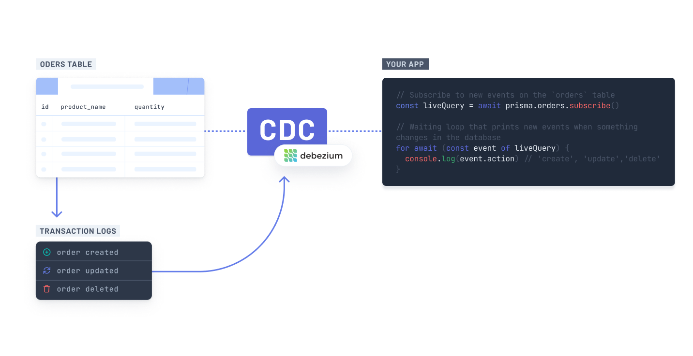

<TopBlock></TopBlock>

## Change data capture

[Change data capture (CDC)](https://en.wikipedia.org/wiki/Change_data_capture) is a technique used to track and capture changes in a database enabling real-time updates. It allows applications to be informed about the modifications in the database, ensuring data consistency between multiple applications.

## Logical replication

Logical replication is a method of replicating data objects and their changes based on their replication identity (usually a primary key). You can read more about logical replication and how it pertains to your database in Postgres' documentation [here](https://www.postgresql.org/docs/current/logical-replication.html).

## Write-ahead log

A [write-ahead log (WAL)](https://www.postgresql.org/docs/current/wal-intro.html) is a standard way of ensuring data integrity by only allowing updates to the data in a database _after_ a log has been written to permanent storage describing the change to take place.

This enhances data integrity because all changes to a database are recorded in these log files. In the event of a database crash, the database is recoverable using those logs and can even be recovered to a specific point in time.
