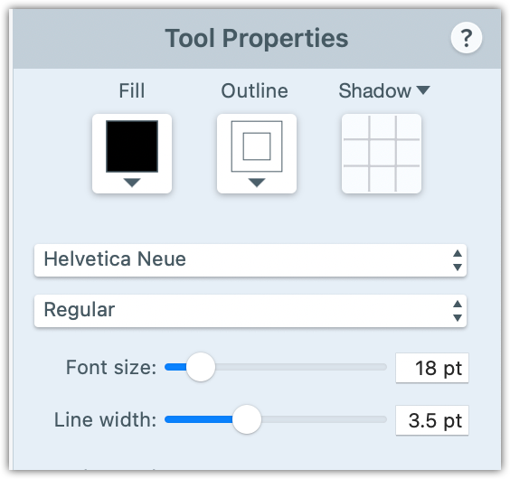

## Screenshots

You can take screenshots with your favorite tool. We find it very easy to use SnagIt when you need to edit screenshots or add annotations to them. We suggest its use as a best practice.

### Style

- Take focused screenshots of visible and legible areas of the UI.
- Apply minimal styling to screenshots. Do not use unnecessary effects, annotations, or styles.
- Exclude unnecessary UI areas and details.
- Use full-screen screenshots only when needed.
- Apply a centered shadow on the entire image canvas. If not, a screenshot with a white-background UI blends with the default white background of Prisma Docs.
- In SnagIt, you can add a shadow with **Effects** > **Shadow** and configure its parameters as listed below.

  - Position: Centered
  - Color: Black
  - Opacity: 75%
  - Blur: 5pt

    <Admonition>

    **Tip**<br /><br />
    For larger and full-screen images, adjust the blur in the range of 7 - 10pt to make the shadow more visible on the page.

    </Admonition>

    

### Annotations

If you can, avoid annotations. If necessary, apply annotations that are minimal and similar in style to the screenshot below.


For details, see the sections below. Again, we suggest the use of SnagIt as a best practice.

#### Text annotations

- Use **Helvetica Neue** font.
- Use black font color.
- Use a font size between 18 and 24 pt for text annotations. Adjust depending on the screenshot size.
- The font size of annotations should not be much bigger than the text in the screenshot.
- Apply a white outline on the text. This ensures that the black text will be visible in Dark mode.



#### Arrow and line annotations

- Use black color for arrows or lines.
- If you have text annotations that use arrows or lines to point to an area on the screenshot, a small part of the line or arrow should appear on the canvas (and outside of the screenshot).
- Apply a centered shadow on each pointer and make the shadow color white. This ensures that the part of the line that is outside of the screenshot remains visible in Dark mode.
  

### File type and path

- Save screenshots as `.png` files.
- Save SnagIt project files in the same location and with the same filename, but with the newer cross-platform `.snagx` file extension.
- Do not use the older, platform-specific file extensions (`.snag` on Windows, `.snagproj` on macOS).

### Filename

- Keep filenames short and descriptive.
- Use only alphanumeric characters.
- Use relevant keywords in filenames for SEO purposes.
- Use hyphens (`-`) to separate keywords.
- Do not use spaces to separate keywords.

### Keywords in filenames

- Use only meaningful keywords.
- Do not use randomized characters in the filename. For example, `d0fjlsf81.png`.
- At the beginning of filenames, use keywords that identify the UI context.
- If applicable, follow with keywords that specify the action that you demonstrate in the screenshot. For example: `data-browser-select-model.png`.

### File location

To decide where to save images, use the guidelines below.

- Save screenshots shared between multiple pages in `content/doc-images/`.
- If a page contains up to two images, save the screenshot files as peers to the MDX file.

```bash
...
06-image-guidelines.mdx
...
snagit-arrow-line-config.png
snagit-arrow-line-config.snagx
snagit-text-annotation-config.png
snagit-text-annotation-config.snagx
```

- If you need more than two images in an MDX file, create a peer `images/` directory and save the image files in it.

````bash
...
06-image-guidelines.mdx
...
images/
  06-01-snagit-arrow-line-config.png
  06-01-snagit-arrow-line-config.snagx
  06-02-snagit-text-annotation-config.png
  06-02-snagit-text-annotation-config.snagx
- At the beginning of each screenshot filename, add the number of the related MDX file.
- After that, use sequential numbering to specify the sequence in which the images appear in the MDX file.

## Diagrams

- Use [Figma](https://www.figma.com) to create diagrams.
- For consistency, when you create a new diagram, base it on an existing one.
- Add the URL of the source image to the Markdown page. Use a comment immediately above the image tag, as follows:

```md
<!-- https://www.figma.com/file/H7EMWAuCaRVHrdNoQpky7J/Tracing?node-id=2%3A37 -->


````

## Add images to MDX files

For full-width images, use the shorter image MDX component:``.

```markdown

```

If you need to shrink an image by width, use the `` component.

```html

```
