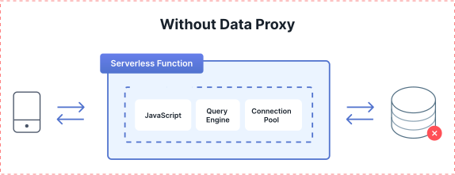
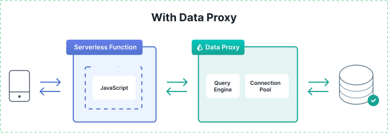

<TopBlock>

Serverless functions are ephemeral and short-lived, so their database connections are numerous and brief. Because of this, using traditional databases in serverless environments often leads to the exhaustion of the maximum number of concurrent database connections and increased latencies when each request needs to establish a database connection.

The Data Proxy in Prisma Data Platform provides database connection management and pooling, load balancing, scaling, and fault tolerance so that you can manage and scale database connections for applications that run with Prisma ORM in serverless environments. With the Data Proxy, your application can scale and maintain predictable database performance because it also limits the total number of database connections.

Designed specifically with serverless functions in mind, the Data Proxy provides a wide range of benefits for applications that run in serverless and edge environments.

</TopBlock>

## Architecture

Prisma develops and maintains the Data Proxy infrastructure and services to provide capabilities that your database application needs to scale when you run your application in serverless and edge environments.

Data Proxy infrastructure is currently available in two regions:

- US East 1 (West Virginia, United States)
- EU Central 1 (Frankfurt, Germany)

<Admonition>

**Request a new Data Proxy region**  

If you want us to make the Data Proxy available in a new region, you can submit your request [here](https://prisma103696.typeform.com/to/Y03RBE5c).

</Admonition>

In each region, the Data Proxy infrastructure has multiple clusters that enable the load balancing, high availability, and failover of database connection pooling and management.

You can use Data Proxy with [all databases that Prisma ORM supports](/reference/database-reference/supported-databases).

## Connection pooling and connection management

Data Proxy provides connection pooling so that your application can reuse active connections and never exhaust the maximum number of connections that your database allows.

Connection pooling with the Data Proxy utilizes orchestrated Prisma [query engine](/concepts/components/prisma-engines/query-engine) technology to open, maintain, and close connection pools. It helps applications load-balance and scale database requests based on demand.

A Data Proxy connection pool maintains active database connections and ensures that an application reuses them when new requests come in.

In each region, Data Proxy management services orchestrate the lifecycle of connection pools. The lifecycle of a Data Proxy connection pool goes through the following stages:

- the assignment of connection pools from each available cluster in the region
- the increase of connection pools when the workload of your application increases
- the maintenance of idle connection pools
- the decrease and stop of connection pools after six minutes of inactivity in a pool

This orchestration ensures that you accumulate Data Proxy usage (in CPU milliseconds) only when your database processes queries.

The orchestration of Data Proxy connection pools ensures high availability, load balancing, and scalability of your application.

- **High availability**. In each region, the Data Proxy infrastructure runs multiple clusters. By default, the Data Proxy starts a connection pool from each cluster and assigns each connection pool to your application. This remains valid until your application reaches higher workloads when the Data Proxy adds new connection pools as needed. If any of the clusters go through a period of downtime, the remaining ones take over the management of connection pools.

    <Admonition>

  **Note**  

  You can select only one of the available regions for an environment of your application in the Prisma Data Platform.  

  Because of this, the high availability of Data Proxy infrastructure applies inside a single region. Data Proxy connection pools from other regions cannot take over an application's connection pool from the current region.

    </Admonition>

- **Load balancing**. In each region, the number of incoming requests for an application is distributed between multiple connection pools running from the different clusters available in the region.
- **Scalability**. Data Proxy creates new connection pools during periods of higher activity and closes connection pools when they are no longer necessary. This orchestration provides the flexibility to scale your database application and allows for reduced costs at times of lower activity.

## Reduced bundle size

By default, Prisma Client bundles the query engine that includes the connection logic for all databases that Prisma supports.

Data Proxy includes the query engine logic to connect and maintain connection pools. This means that when you generate Prisma Client to work with Data Proxy, your application bundle does not need to include the query engine logic. As a result, your application has a reduced bundle size, which speeds up load times and improves performance.

## Faster cold starts

With the Data Proxy and with a reduced bundle size, you achieve faster serverless cold starts. This is possible because the query engine logic is no longer included in the bundle size and because the Data Proxy keeps the existing database connections live on the remote Data Proxy and reuses them for new requests.

## In this section

<Subsections />
