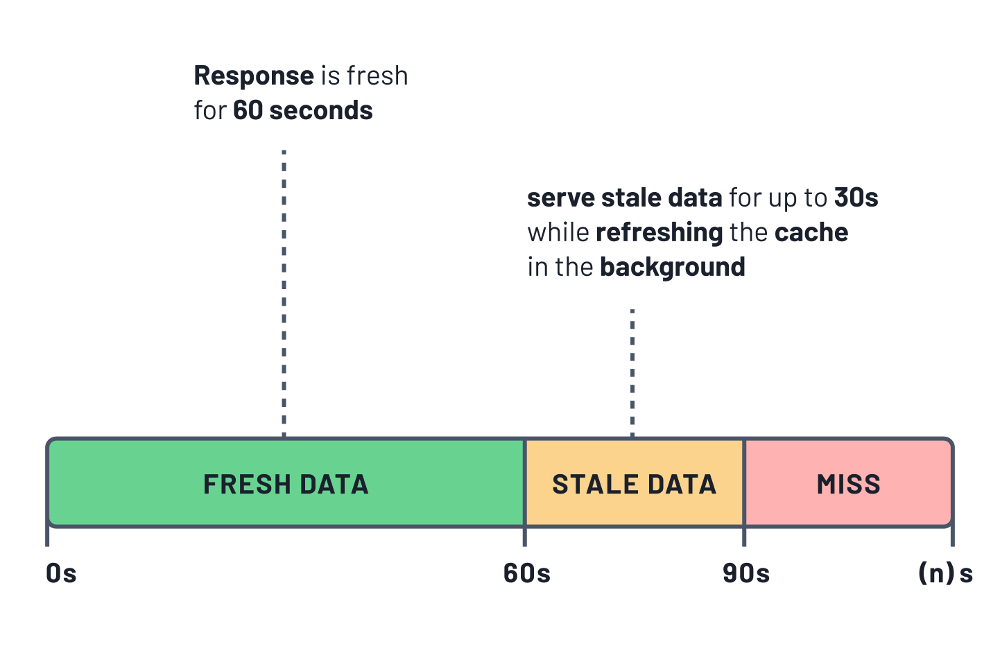

<TopBlock></TopBlock>

## Cache strategies

For all read queries in Prisma Client, you can define the `cacheStrategy` parameter that configures cache behavior. The cache strategy allows you to define two main characteristics of the cache:

- **Time-to-live (TTL):** Duration in seconds a cached response is considered _fresh_.
- **Stale-while-Revalidating (SWR):** Duration in seconds a stale cache response is considered acceptable while the cache is refreshed in the background

## Time-to-live (TTL)

Time-to-live (TTL) specifies the time for which the data in the cache is considered _fresh_.

Accelerate returns previously cached data if the age of the cached data is not greater than the TTL specified. In this case, no query is executed against the database. If cached data for the request is unavailable, Accelerate queries the database and stores the results in the cache for future requests.

TTL is useful for reducing database load and latency for data that does not require frequent updates.

Use `ttl` in `cacheStrategy` and specify the TTL of the query in seconds.

## Stale-While-Revalidate (SWR)

Stale-While-Revalidate (SWR) specifies the number of seconds that Accelerate may serve _stale_ cache data while requesting _fresh_ data from the database.

Accelerate returns previously cached data if the age of the cached data is not greater than the SWR specified. But, in the background, Accelerate refreshes the cache by fetching the data from the database.

SWR is useful for reducing the latency of accessing the data while maintaining a more up-to-date value in the Accelerate cache.

Use the `swr` parameter in `cacheStrategy` and specify the SWR of the query in seconds.

## Time-to-live and Stale-While-Revalidate combination

You can use both TTL and SWR and stack them for the same query. SWR applies _after_ TTL has expired.

Accelerate returns previously cached data up to the age specified in TTL without revalidating. After TTL expires, Accelerate serves the cached data as stale up to the age specified in SWR and revalidates it in the background. The total number of seconds that data will remain in the cache is `ttl + swr`.

It is useful to combine TTL and SWR to maintain low latency while Accelerate refreshes cached data in the background.

_Example timeline with cache strategy `{ ttl: 60, swr: 30 }`_

## Selecting a cache strategy

Caching helps you improve query response times and reduce database load. However, it also means you might serve stale data to the client. Whether or not serving stale data is acceptable and to what extent depends on your use case. `ttl` and `swr` are parameters you can use the tweak the cache behavior.

- **TTL :** Use TTL to reduce database load when stale cached data is acceptable.
- **SWR :** Use SWR to respond quickly to requests with minimal stale data. While it does not reduce database load, it can improve response times significantly.
- **TTL** + **SWR:** For very fast response times and reduced database load, use both TTL and SWR. You can use this strategy to fine-tune your application’s tolerance for stale data.
