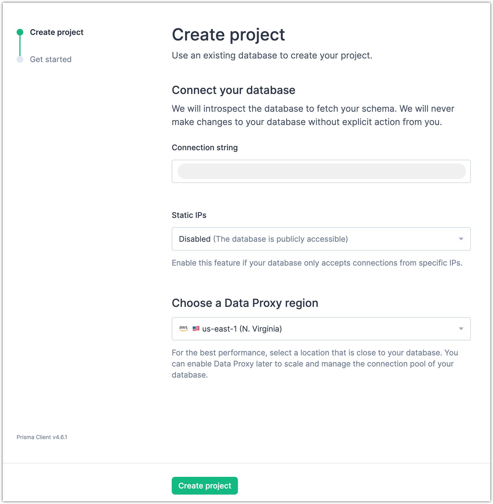
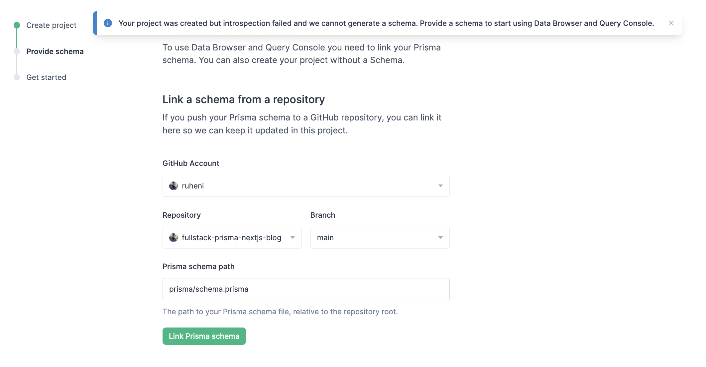
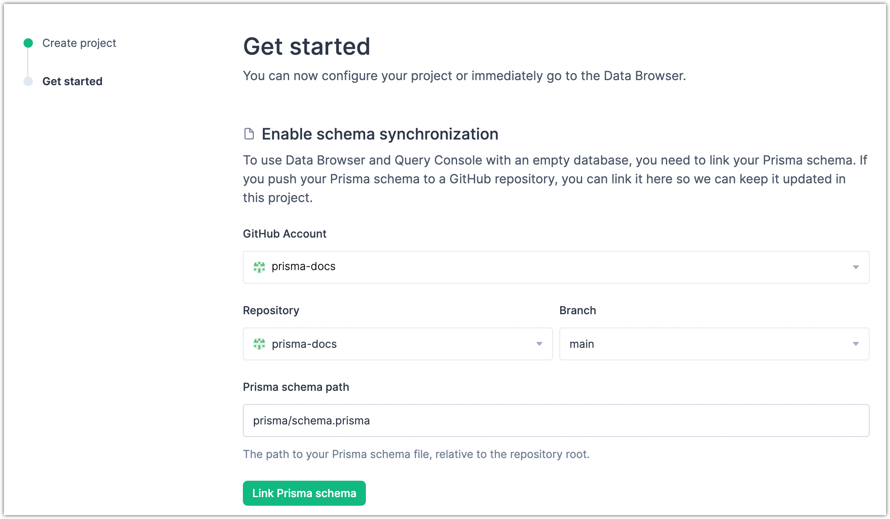
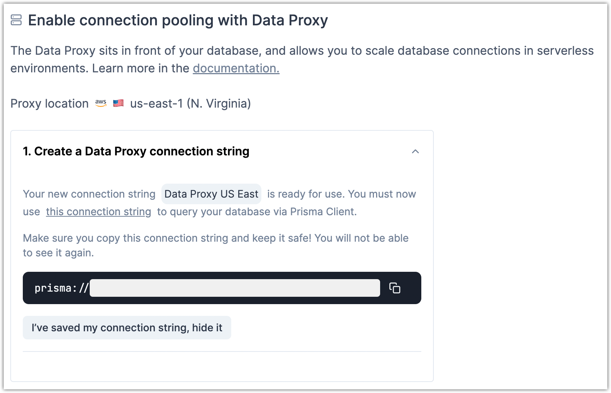

<TopBlock>

In the Prisma Data Platform, you can create new projects with just a connection string for an available database. If your database sits behind a firewall or only allows connections from specific IPs, you can enable the use of [static IPs of the platform](/data-platform/static-ips) and add them to your database allowlist. You can also select the [Data Proxy](/data-platform/data-proxy) region to prepare your project for connection pooling and load balancing in serverless environments.

After you create your project, you can optionally link your Prisma schema (if you push it to a GitHub repository) so that we can keep your project in sync with its latest version.

<details>

<summary>Why should I link my Prisma schema and GitHub repository?</summary>

The features in [Data Browser](/data-platform/data-browser) and [Query Console](/data-platform/query-console) rely on an up-to-date schema that matches the latest data model in your database.<br /><br />

When you _create a project with an existing database_, the platform introspects your database and generates a Prisma schema for your project. If you make a change to your database model and the platform does not have a linked schema, you and your team might start seeing errors while you use [Data Browser](/data-platform/data-browser) and [Query Console](/data-platform/query-console).<br /><br />

If you _create a project with an empty database_, [Data Browser](/data-platform/data-browser) and [Query Console](/data-platform/query-console) remain inactive for the project because the database introspection cannot generate a Prisma schema from an empty database.

</details>

Later, if you want to enable connection pooling and load balancing of database connections with the Data Proxy, you can copy the Data Proxy connection string for the project.

</TopBlock>

## Create a project

When you create a project, you only need a database connection string.

### Prerequisites

Copy the database connection string for your project. The platform uses the connection string only to read and introspect the database.

<Admonition>

**Note**<br /><br />

Check that the connection string meets the requirements listed below.

- Use a [Prisma ORM-supported database](/reference/database-reference/supported-databases).
- The connection string must include `user` and `password`
- Use the connection string format below.
  ```code no-copy
  <db-type>://<user>:<password>@<hostname>:<port>/<db-name>
  ```

</Admonition>

### Steps

1. From the [**Projects**](https://cloud.prisma.io/projects/) page, click **New Project**.
2. In **Connection string**, paste the database connection string.
3. (Optional) From **Static IPs**, select **Enabled** if your database is behind a firewall and you can only configure external access from specific IP addresses. Copy the IP addresses and add them to the allowlist of your database.

   <Admonition>

   **Note**<br /><br />
   For more information, see [Static egress IP address](/data-platform/static-ips).

   </Admonition>

4. From **Choose a Data Proxy region**, select the geographic location for the Data Proxy.

   <Admonition type="warning">

   **Important**<br /><br />
   Select a Data Proxy location that is close to the geographic location of your database.<br /><br />
   If you select a location that is remote from your database, then when your application sends requests to your database through the Data Proxy, you might notice some delay in the responses.

   </Admonition>

   After you create the project, you can [create a Data Proxy connection string](#optional-create-a-data-proxy-connection-string) and use that to set up connection pooling locally or in your deployment environment.

5. Click **Create project**.
   

### Result

The platform creates your project and assigns it a random name, such as **Grey&nbsp;fish&nbsp;<random-code\>**, where **<random-code\>** is an auto-generated code. You can later [change the project name](/data-platform/projects/edit-settings) from the project settings.

#### If your database does not contain any models

You see a notification that your database is empty. Because your database does not contain any models, the introspection cannot generate a Prisma schema.

As a result, [Data Browser](/data-platform/data-browser) and [Query Console](/data-platform/query-console) are inactive. You can start using them after you [enable Prisma schema synchronization](#optional-enable-schema-synchronization).

#### If your database contains models

The platform introspects the database to read the data models so that it can generate the Prisma schema. The Prisma schema enables the features in [Data Browser](/data-platform/data-browser) and [Query Console](/data-platform/query-console), where you can edit and query your data.

#### If introspection fails and can't generate a schema

You will be prompted a notification telling that your project was created but introspection failed. Introspection may fail if the database is unreachable or the process timeouts. In order to utilize the Data Browser or Query Console, a project must have a valid Prisma schema that matches with the provided database.

Upon introspection failure, you will be taken to a "Provide schema" view, where you can [provide a schema](#optional-provide-a-schema) by either linking a schema from a repository or upload your schema.

### What's next

- Click **Skip and continue to Data Platform** to go to **Data Browser** for your project.<br /><br />
  If your database is empty, you are redirected to **Schema Viewer** where you can optionally provide a GitHub repository with your Prisma schema to set up schema synchronization.
- If introspection fails, you can remain on the **Provide a schema** screen and complete project setup
  - [(Optional) Provide a schema](#optional-provide-a-schema)
- Alternatively, remain on the **Get started** screen and complete the optional configurations for your project.
  - [(Optional) Enable Prisma schema synchronization](#optional-enable-schema-synchronization)
  - [(Optional) Create a Data Proxy connection string](#optional-create-a-data-proxy-connection-string)

## (Optional) Provide a schema

After you create a project but introspection fails, you can provide a schema on the **Provide a schema** screen. You can provide a schema by either linking a schema from a repository or uploading your schema file

You can link a schema from a repository to keep your project's Prisma schema and data models in **Data Browser** and **Query Console** updated with the latest version of your Prisma schema.

#### Link a schema from a repository

Steps:

1. On the **Link a schema from a repository** section, from **GitHub Account**, select a GitHub account or organization.
2. From **Repository**, select the GitHub repository you want to import.
3. From **Branch**, select the branch you want to import.
4. In **Prisma schema path**, enter the path to the `schema.prisma` file.

   <Admonition>

   **Note**<br /><br />

   The pre-filled path `prisma/schema.prisma` is the default path. Change it to the path you use for your project.

   </Admonition>

5. Click **Link Prisma schema**.<br />
   

#### Result

A Prisma schema is now linked to your project.

The platform updates the Prisma schema in your project every time you push a schema change to your repository.

#### Upload a schema file

Steps:

1. On the **Or upload your schema** section, either:
   - Click on the _drop zone_ to open your file manager and select your schema
   - Drag and drop your schema file to the _drop zone_
2. Review the preview of your schema file

   <Admonition>

   **Note**<br /><br />

   The schema preview does not contain any syntax highlighting for your schema file.

   </Admonition>

3. Click **Upload file**.<br />

   

#### Result

A Prisma schema is now linked to your project. However, the schema will not be synchronized with your project. You can manually synchronize the Prisma schema in your project by refreshing the schema in the **Schema** tab of your project.

To keep your schema in sync with your project, you can link the project to a GitHub repository.

#### What's next

You can now use [Data Browser](/data-platform/data-browser) and [Query Console](/data-platform/query-console) with the latest version of your Prisma schema.

## (Optional) Enable schema synchronization

After you create the project, you can enable automated schema synchronization on the **Get started** screen. This means that if you push your Prisma schema to a GitHub repository, you can link the Prisma schema and the GitHub repository to your project.

With this, the platform can keep the Prisma schema up-to-date for your project and also keep the data models in **Data Browser** and **Query Console** updated with the latest version of your Prisma schema.

### Steps

1. On the **Get started** screen, from **GitHub Accounts & Organizations**, select a GitHub account or an organization.
2. From **Repository**, select the GitHub repository you want to import.
3. From **Branch**, select the branch you want to import.
4. In **Prisma schema path**, enter the path to the `schema.prisma` file.

   <Admonition>

   **Note**<br /><br />

   The pre-filled path `prisma/schema.prisma` is the default path. Change it to the path you use for your project.

   </Admonition>

5. Click **Link Prisma schema**.<br />
   

### Result

The repository and the Prisma schema are now linked to your project. The platform updates the Prisma schema in your project every time you push a change to it.

### What's next

You can now use [Data Browser](/data-platform/data-browser) and [Query Console](/data-platform/query-console) with the latest version of your Prisma schema.

## (Optional) Create a Data Proxy connection string

After you create the project, you can create and copy a Data Proxy connection string for the project on the **Get started** screen. You can then use the connection string in Prisma Client to enable connection pooling and load balancing of database connections locally or in your deployment environment.

### Steps

1. Click **Generate a Data Proxy connection string**.
2. Click **Create a new connection string**.
3. Enter a name for the connection string and click **Create**.
4. Copy the `prisma://` connection string.

   

### What's next

You can now [enable connection pooling with Data Proxy](/data-platform/data-proxy#using-the-data-proxy-in-a-prisma-application) locally or in your deployment environment.

## Next steps

With your project created in the Prisma Data Platform, you can explore your project with **Data Browser**, **Query Console**, and **Schema Viewer**.

- [Manage data with Data Browser](/data-platform/data-browser)
- [Test and run queries with Query Console](/data-platform/query-console)
- [Manage schema updates with Schema Viewer](/data-platform/schema-viewer)

Next, you can [develop your Prisma schema and your database models](/concepts/components/prisma-schema/data-model) further and [migrate any schema changes to your database](/concepts/components/prisma-migrate) with [`prisma migrate dev`](/reference/api-reference/command-reference#migrate-dev).

You can also change your project settings or add new environments if you want to isolate development activities with test databases and test branches, and select a different Data Proxy region for an environment.

- [Edit project settings](/data-platform/projects/edit-settings)
- [Environments](/data-platform/environments)
