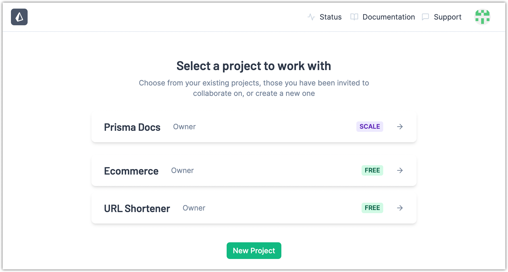

<TopBlock>

A _project_ in the Prisma Data Platform is an organizational unit for your JavaScript/TypeScript application that uses Prisma ORM.

You use projects to manage:

- [environments](/data-platform/environments)
  - GitHub repository and branch
  - database connection string
  - Data Proxy region
- [members](/data-platform/members)
- [paid plan and billing](/data-platform/billing/plans-and-quotas)

In the Prisma Data Platform, you can [add projects](/data-platform/projects/add-project) with one of the following workflows to create new or import existing projects.

- [Create a new database application from a template](/data-platform/projects/add-project/create-new-project-from-template)
- [Import an existing database application with an existing database](/data-platform/projects/add-project/import-existing-project-existing-db)
- [Import an existing database application with a new database](/data-platform/projects/add-project/import-existing-project-new-db)

For each project, you can edit the project name and URL handle, and when you no longer need a project, you can delete it.

- [Edit project settings](/data-platform/projects/edit-settings)
- [Delete a project](/data-platform/projects/delete-project)

You can view all of your existing projects on the [_Projects_](https://cloud.prisma.io/projects) page. Projects are grouped in the list based on their [plan](/data-platform/billing/plans-and-quotas) in the following order:

1. [Scale](/data-platform/billing/plans-and-quotas#strongscalestrong-plan)
2. [Free](/data-platform/billing/plans-and-quotas#strongfreestrong-plan)

Within each group, project names are sorted in alphabetical order.

</TopBlock>
