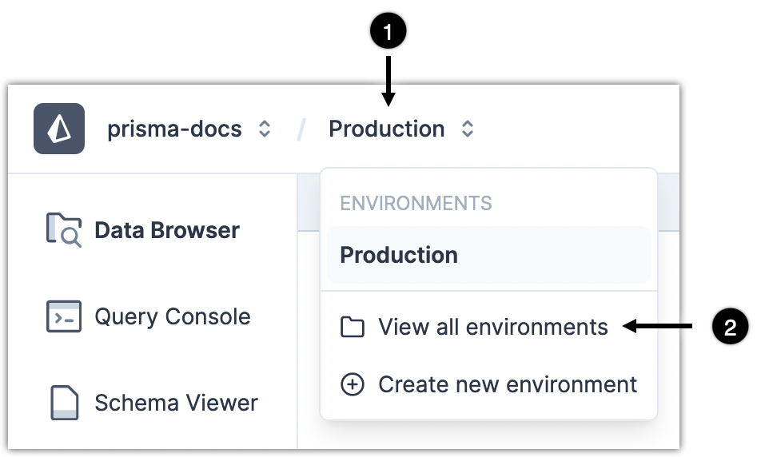
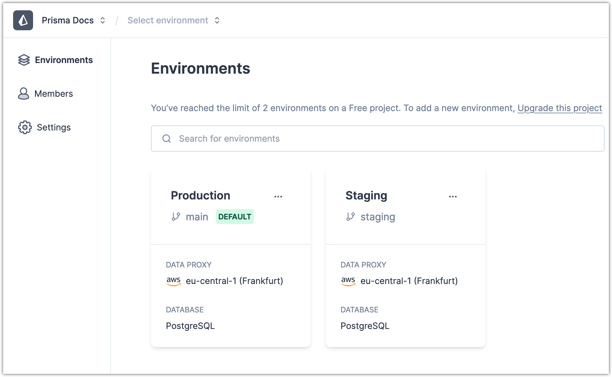

<TopBlock>

With a project currently open, you can view all [environments](/data-platform/environments) in the project from the **Environments** drop-down (to the right of the **Projects** drop-down in the upper left).

</TopBlock>

## Steps

1. In the upper left, click the **Environments** drop-down menu.
2. Select **View all environments**.
   

## Result

The **Environments** tab for the project shows the list of environments with the option to search your environments by name.

## What's next

- [Create an environment](/data-platform/environments/create)
- [Change the default environment](/data-platform/environments/edit-settings/change-default-environment)
- [Edit environment settings](/data-platform/environments/edit-settings)
- [Delete an environment](/data-platform/environments/delete)
