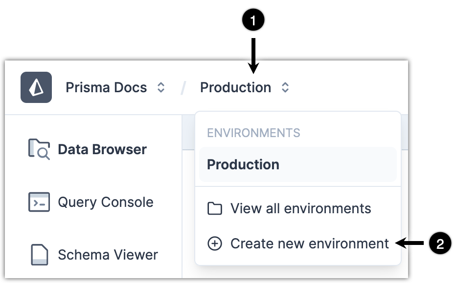
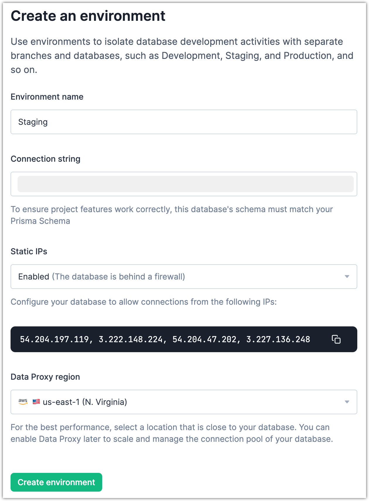
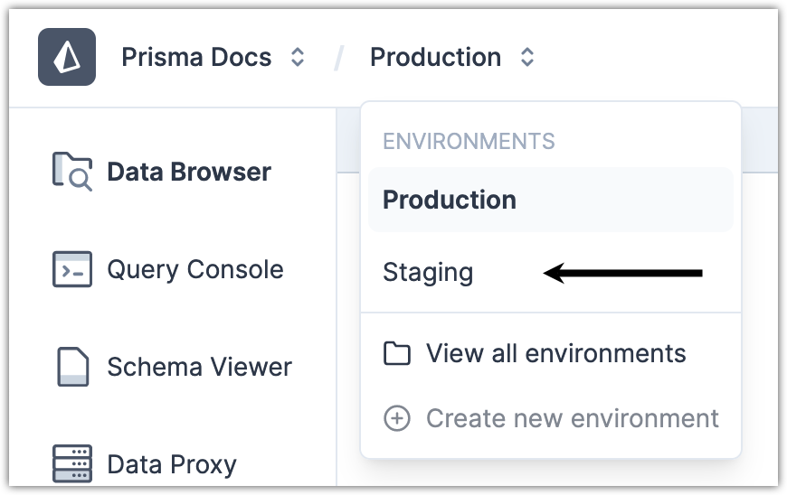
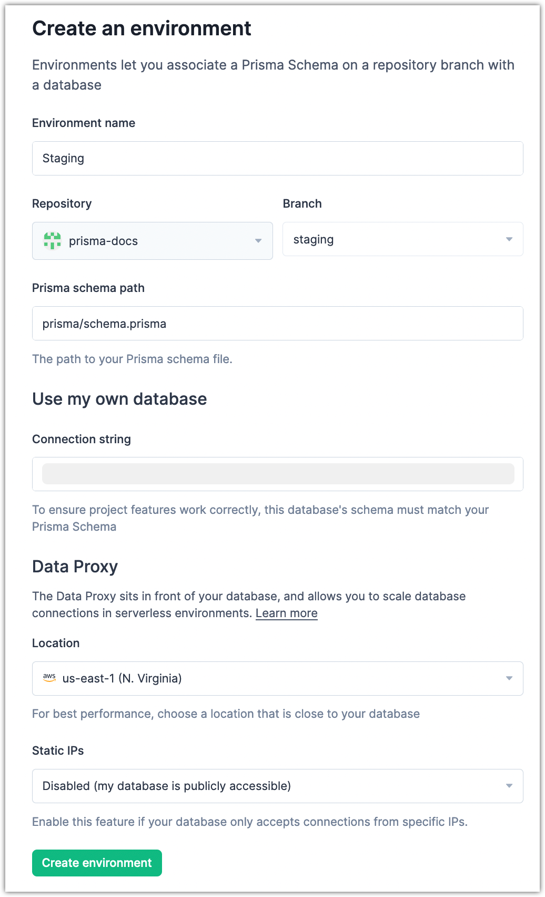
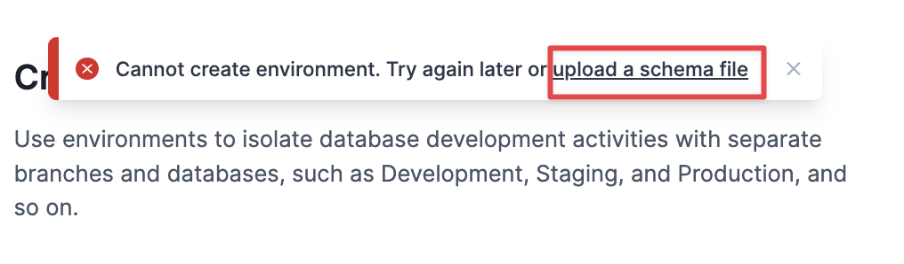
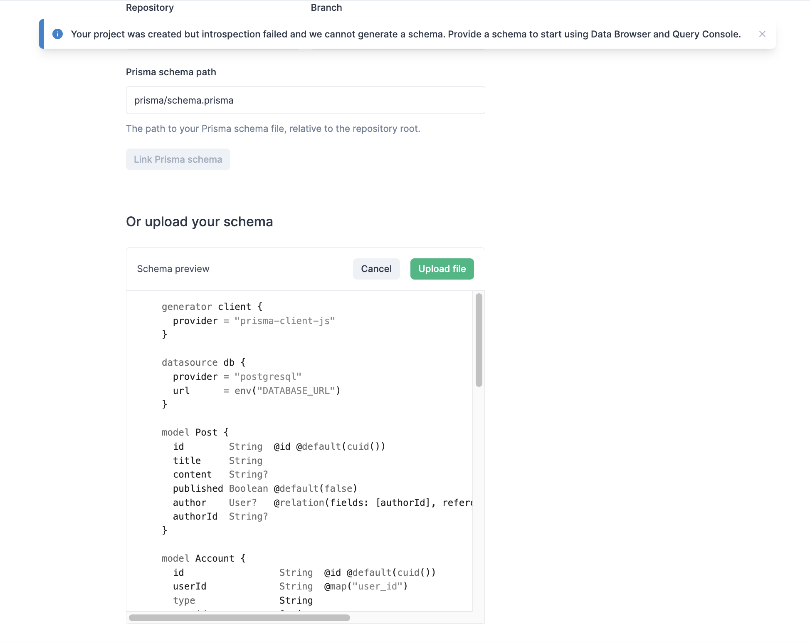

<TopBlock>

For any project in the Prisma Data Platform, you can create multiple [environments](/data-platform/environments) and associate each with a different database and a different Data Proxy region.

You can use environments to isolate database development activities with separate branches and databases, and dedicate each environment to an activity, such as Development, Staging, Production, and so on.

</TopBlock>

## About creating environments

When you create a new environment on a project, the steps differ slightly depending on whether you have schema synchronization enabled on the default environment.

The table below shows the different project configurations and provides links to the correct steps to create a new environment for each project configuration.

| Configuration                                                                      | Steps                                                            |
| ---------------------------------------------------------------------------------- | ---------------------------------------------------------------- |
| Projects with enabled schema synchronization                                       | [Steps](#projects-with-enabled-schema-synchronization)           |
| Projects with introspected schema or no schema (empty database) or uploaded schema | [Steps](#projects-with-an-introspected-schema-or-with-no-schema) |

## Projects with enabled schema synchronization

If you already have schema synchronization enabled for the default Production environment, you can do the same for each new environment you create.

### Prerequisites

- You are the [Project owner](/data-platform/members/roles-permissions) or have the [Admin](/data-platform/members/roles-permissions) role for the project.
- You have a database connection string for the new environment.
- Based on your [project plan quota](/data-platform/billing/plans-and-quotas), check if you have the capacity for more environments.
- Create a new branch in the GitHub repository of the project and push new versions of the Prisma schema for the environment in that branch.

### Steps

1. From the **Environments** drop-down menu, select **Create new environment**.
   
2. In **Environment name**, enter a name for the environment.

   <Admonition>

   **Note**  
   Use any naming convention that makes sense for your project.  
   If applicable, you can use the Staging, Development, or &lt;Feature name&gt; conventions to dedicate an environment to a database development workflow or the development of a specific feature.

   </Admonition>

3. Enable schema synchronization for the new environment.

  <Admonition>

    **Note**  

    The steps to enable schema synchronization on new environments are available only if you have already enabled schema synchronization on the default Production environment for the same project.

  </Admonition>

a. From **Branch**, select the branch of the project repository that you want to use for the new environment.

    <Admonition type="alert">

    **Important**  

    You must select a branch from the same repository configured for the Production environment.  

    Because of this, you cannot select a different repository when you create a new environment.

    </Admonition>

b. In **Prisma Schema path**, enter the path to the `schema.prisma` file.

    <Admonition>

    **Note**  

    The pre-filled path `prisma/schema.prisma` is the default path. Change it to the path you plan to use in the environment.

    </Admonition>

5. In **Connection string**, paste the database connection string for the new environment.
6. (Optional) From **Static IPs**, select **Enabled** if your database is behind a firewall and you can only configure external access from specific IP addresses. Copy the IP addresses and add them to the allowlist of your database.

   <Admonition>

   **Note**  

   For more information, see [Static egress IP address](/data-platform/static-ips).

   </Admonition>

   7. Under **Data Proxy**, from the **Location** drop-down menu, select the geographic location for the Data Proxy.

  <Admonition>

    **Note**  

    Select a Data Proxy location that is close to the geographic location of the database for the new environment.  
    If you select a location that is geographically distant from the database, then when your application sends requests to the database through the Data Proxy, you might notice some delay in the responses.

  </Admonition>

  <Admonition type="alert">

    **Important**  

    After you create an environment, you cannot change its Data Proxy location. You can select a different Data Proxy location only when you create a new environment.

  </Admonition>

8. Click **Create environment**.
   

### Result

The platform creates a new environment for the project. The new environment appears in the **Environments** drop-down menu.

The platform links the Prisma schema from the selected branch so that it can keep your project up-to-date with the latest schema version. Your updates to your Prisma schema keep the models and attributes up-to-date in **Data Browser**, **Query Console**, and also the schema contents in **Schema Viewer**.

Your browser is redirected to **Data Browser** for the new environment.

### What's next

You can switch between the environments of a project from the **Environments** drop-down menu in the upper left (next to the **Projects** drop-down).

- After you switch to a different environment, **Data Browser** and **Query Console** use the database and Data Proxy location configured for that environment.
- What **Schema Viewer** shows differs depending on whether your database is empty or contains some models. For more information, see [Manage schema updates with Schema Viewer](/data-platform/schema-viewer).

## Projects with an introspected schema or with no schema

If you do not yet have schema synchronization enabled for the Production environment of a project (that means that the database is empty or that the platform introspected and generated a Prisma schema), you can create new environments without the need to enable schema synchronization.

### Prerequisites

- You are the [Project owner](/data-platform/members/roles-permissions) or have the [Admin](/data-platform/members/roles-permissions) role for the project to create a new environment.
- You have a database connection string for the new environment.
- Based on your [project plan quota](/data-platform/billing/plans-and-quotas), check if you have the capacity for more environments.

### Steps

1. From the **Environments** drop-down menu, select **Create new environment**.

{' '}

2. In **Environment name**, enter a name for the environment.

   <Admonition>

   **Note**  
   Use any naming convention that makes sense for your project.  
   If applicable, you can use the Staging, Development, or &lt;Feature name&gt; conventions to dedicate an environment to a database development workflow or the development of a specific feature.

   </Admonition>

3. In **Connection string**, paste the database connection string for the new environment.
4. (Optional) From **Static IPs**, select **Enabled** if your database is behind a firewall and you can only configure external access from specific IP addresses. Copy the IP addresses and add them to the allowlist of your database.

   <Admonition>

   **Note**  

   For more information, see [Static egress IP address](/data-platform/static-ips).

   </Admonition>

5. Under **Data Proxy**, from the **Location** drop-down menu, select the geographic location for the Data Proxy.

  <Admonition>

    **Note**  

    Select a Data Proxy location that is close to the geographic location of the database for the new environment.  
    If you select a location that is geographically distant from the database, then when your application sends requests to the database through the Data Proxy, you might notice some delay in the responses.

  </Admonition>

  <Admonition type="alert">

    **Important**  

    After you create an environment, you cannot change its Data Proxy location. You can select a different Data Proxy location only when you create a new environment.

  </Admonition>

6. Click **Create environment**.
   

### Result

The platform creates a new environment for the project. The new environment appears in the **Environments** drop-down menu.

#### If the database for the new environment does not contain any models

You see a notification that the database for the new environment is empty. Because the database does not contain any models, the introspection cannot generate a Prisma schema.

As a result, **Data Browser** or **Query Console** for the environment remain inactive. You can start using them after you enable Prisma schema synchronization for the environment.

Your browser is redirected to **Schema Viewer** for the new environment.

#### If the database for the new environment contains models

The platform introspects the database to read the data models so that it can generate the Prisma schema. The Prisma schema enables the features in **Data Browser** and **Query Console**, where you can edit and query your data, or view your schema.

Your browser is redirected to **Data Browser** for the new environment.

#### If introspection fails and can't generate a schema

You will be prompted with an error notification that introspection failed. This means the environment was not created. The error prompt will contain an **Upload a schema** button that will allow you to complete environment creation by [uploading a schema](#upload-a-schema-file).

##### Upload a schema file

Steps:

1. On the notification, click **Upload a schema file**

   

2. On the **Upload a schema file** section, either
   - Click on the _drop zone_ to open your file manager and select your schema
   - Drag and drop your schema file to the _drop zone_
3. Review the preview of your schema file

   <Admonition>

   **Note**  

   The schema preview does not contain any syntax highlighting for your schema file.

   </Admonition>

4. Click **Upload file**. 

   

### What's next

You can switch between the environments of a project from the **Environments** drop-down menu in the upper left (next to the **Projects** drop-down).

- After you switch to a different environment, **Data Browser** and **Query Console** use the database and Data Proxy location configured for that environment.
- What **Schema Viewer** shows differs depending on whether your database is empty or contains some models. For more information, see [Manage schema updates with Schema Viewer](/data-platform/schema-viewer).
