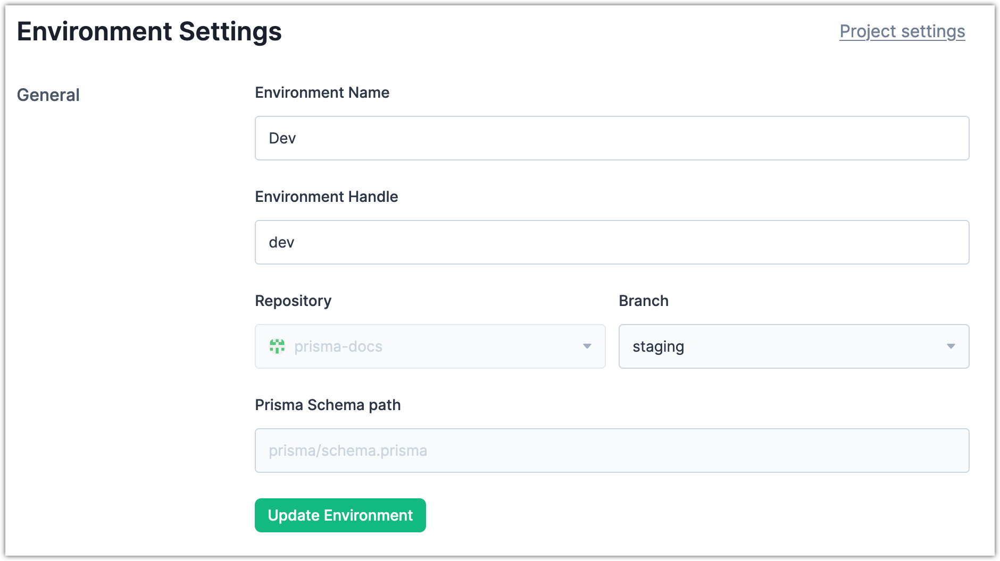

<TopBlock>

In a Prisma Data Platform project, you can change the [environment](/data-platform/environments) name. In the interface, the environment name appears in the **Environments** drop-down menu and in the **Environments** tab for a project.
You can also change the URL handle for an environment. This changes the URL that you can use to reach the environment. The URL format below shows how an environment URL handle appears after the project handle.

`https://cloud.prisma.io/<github_username>/<project>/<environment>`

- `github_username`. Your GitHub username.
- `project_name`. The URL handle of a project in the Prisma Data Platform.
- `environment_name`. The URL handle of a project environment in the Prisma Data Platform.

</TopBlock>

## Prerequisites

You must have the [Project owner](/data-platform/members/roles-permissions) or [Admin](/data-platform/members/roles-permissions) role for the project to change the environment name and URL handle.

## Steps

1. In the Prisma Data Platform, open a project.
2. In the upper left, click the **Projects** drop-down and select **Project settings**.
3. Select the **Environments** tab.
4. Click the three-dot menu for an environment and select **Settings**.
5. (Optional) In **Environment Name**, change the name for the environment.
6. (Optional) In **Environment Handle**, change the URL handle for the environment.
7. Click **Update Environment**.

