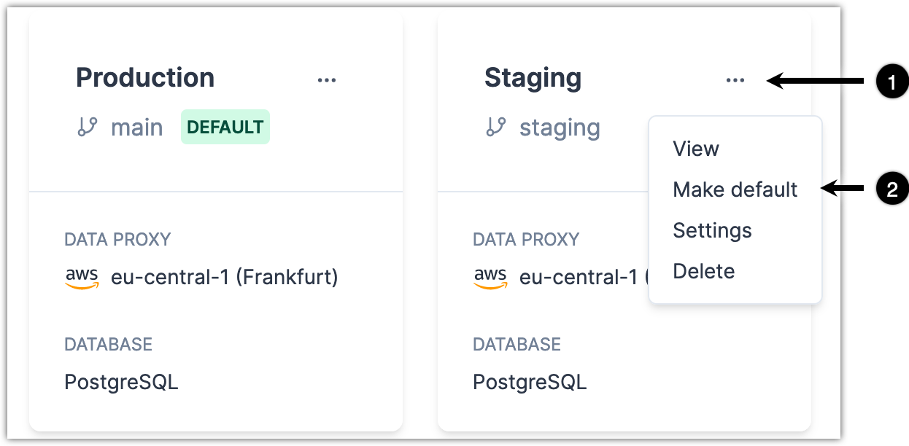

<TopBlock>

Every Prisma Data Platform project has a default [environment](/data-platform/environments). This default environment determines which database, Data Proxy location, and GitHub repository a person uses when they open Data Browser, Query Console, or Schema Viewer in that project. You can set any environment in a project to be the default environment.

</TopBlock>

## Prerequisites

You are the [Project owner](/data-platform/members/roles-permissions) or [Admin](/data-platform/members/roles-permissions) role for the project to change the default environment.

## Steps

1. In the Prisma Data Platform, open a project.
2. In the upper left, click the **Projects** drop-down and select **Project settings**.
3. Select the **Environments** tab.
4. Click the three-dot menu for an environment and select **Make default**.
   

## Result

When someone opens the project, they use Data Browser, Query Console, and Schema Viewer in the new default environment.
