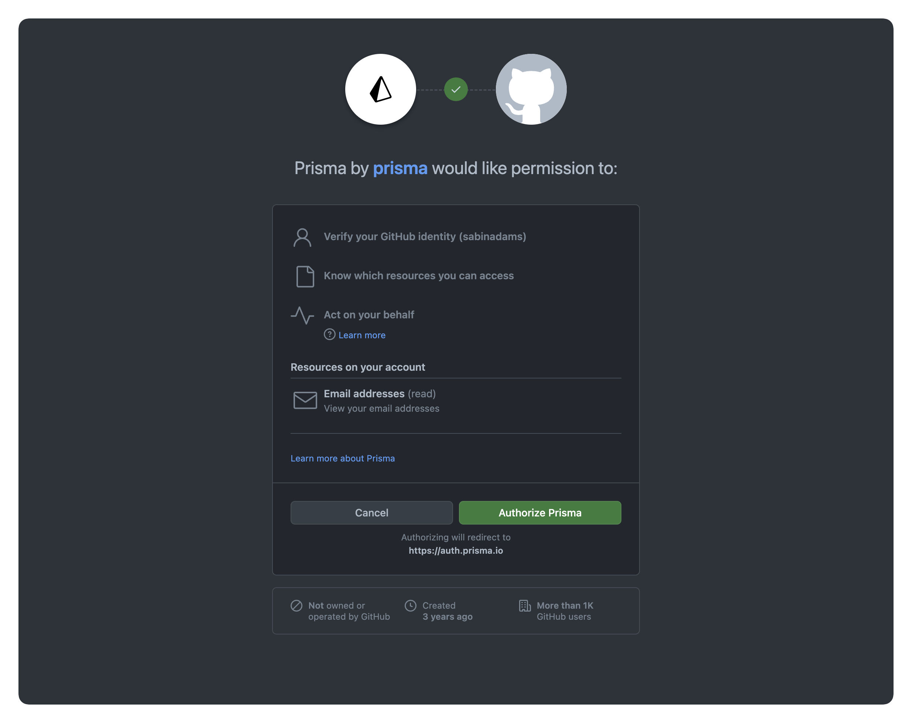
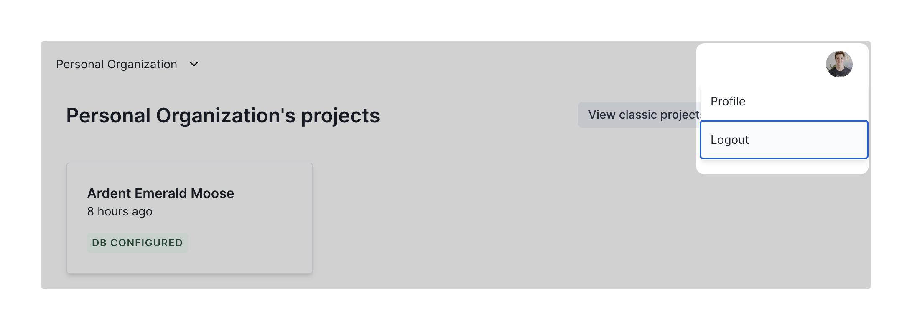
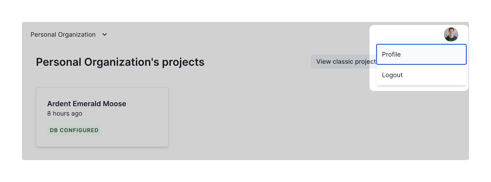
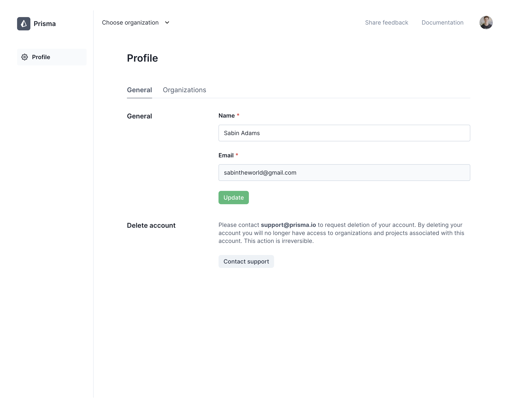
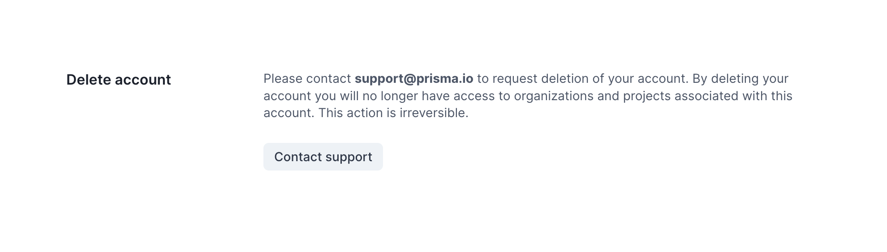

<TopBlock>

To access Cloud Projects, you must have an account on the [Cloud Projects platform](https://cloudprojects.prisma.io/). You can sign up and sign in with your GitHub account.

</TopBlock>

## Sign in / Sign up

Cloud Projects uses your GitHub account to sign in and sign up for the platform. On the Cloud Projects login screen, click the **Continue with GitHub** button to sign in or sign up.

When you sign in for the first time, you will be asked to authorize Prisma on your GitHub account:

Click **Authorize Prisma** to give Cloud Projects access to the email address associated with your GitHub account. This is what is used to identify your account within the Cloud Projects platform.

<Admonition type="info">
  The first time you sign in, a personal organization will be created for you as
  well as a project associated with that organization.
</Admonition>

## Sign out

To sign out of your Cloud Projects account, click your account profile image at the top-right of the screen and click the **Logout** option.

## Profile

To view your account settings, click your account profile picture at the top-right of the screen and click the **Profile** option:

Within the **Profile** page in the **General** tab you can update your account’s full name by filling out the **Full name** field and clicking the **Update** button:

## Delete an account

If you wish to delete your account, follow the prompt on your Profile page to contact Prisma support:

<Admonition type="info">
  This is a temporary requirement. The ability to delete an account on your own
  will be available soon.
</Admonition>
