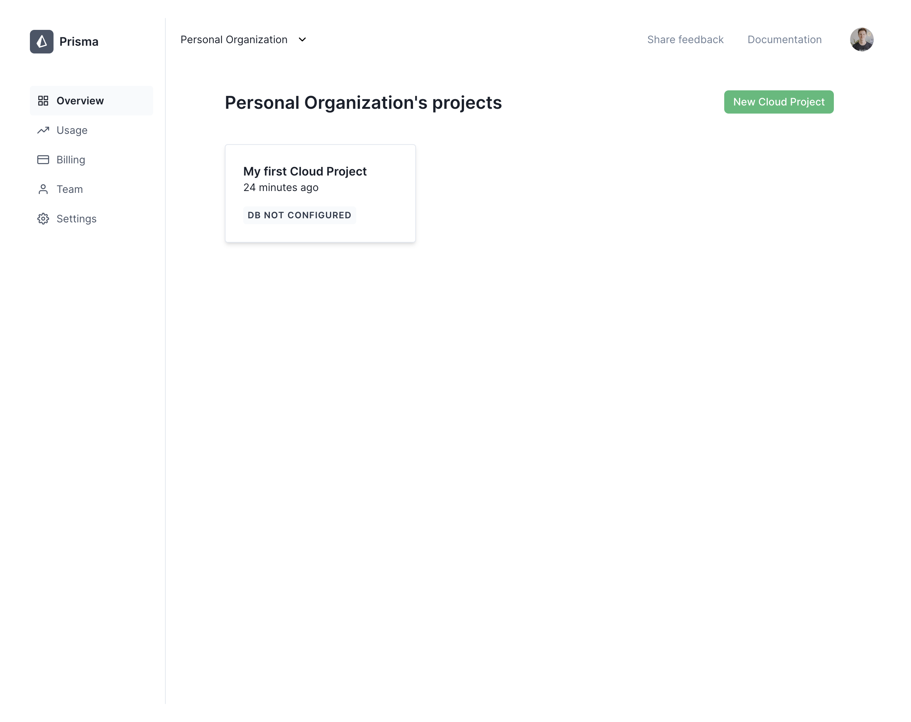
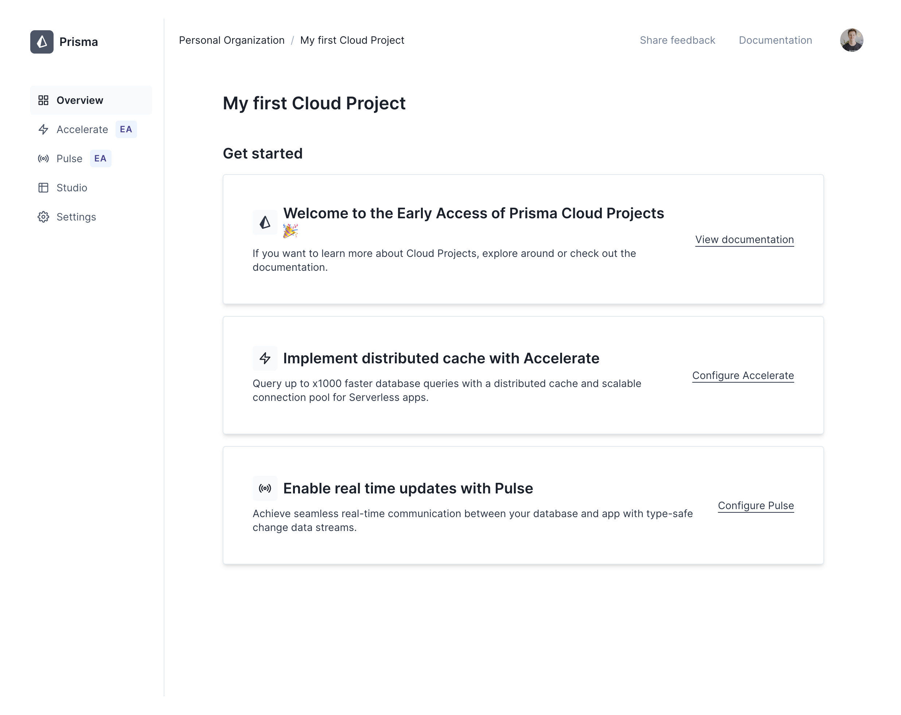
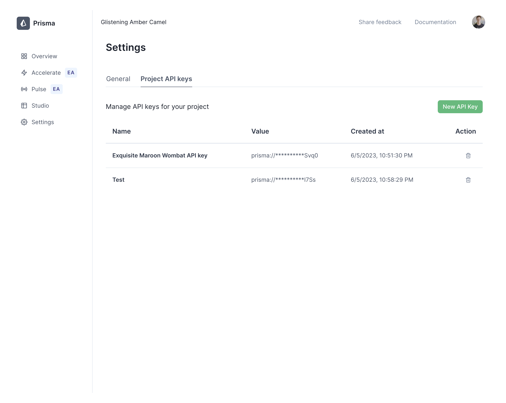
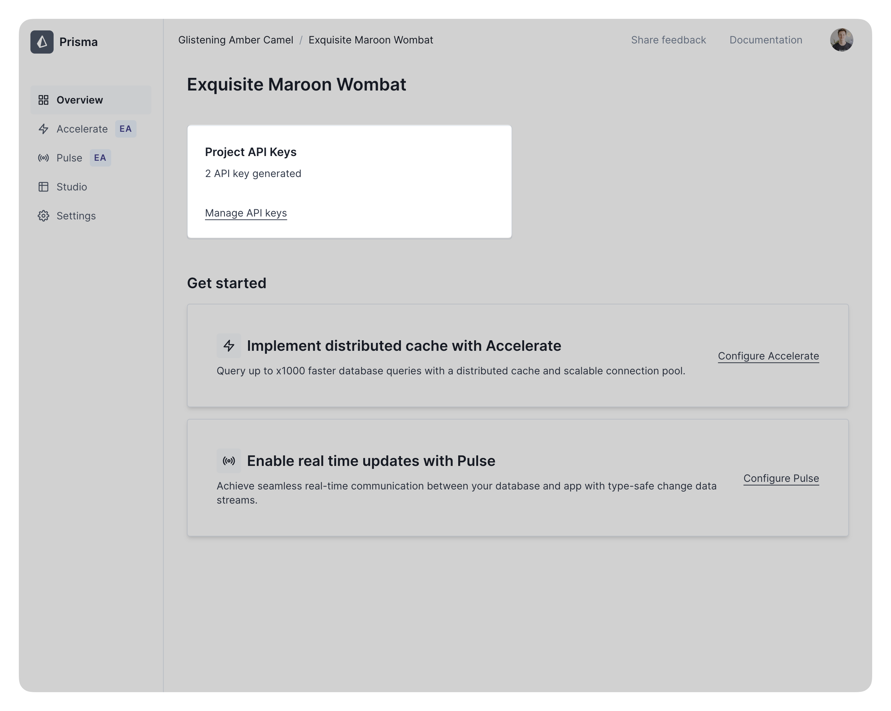

<TopBlock>

Projects represent your applications that use Prisma ORM. Each individual project is associated with an <b><a href="/data-platform/cloud-projects/platform/organizations">Organization</a></b> and may be configured separately from the other projects in that organization.

</TopBlock>

## View an organization's projects

On the **Overview** section of your organization you will see a list of the projects associated with that organization:

Each list item will display the project’s name, when it was created and whether or not a database has been connected to any product in the project. Clicking any of these projects will bring you into that project’s **Overview** page:

A project’s details page is where you can:

- View the project’s settings
- Generate project API keys
- Configure applications such as Pulse and Accelerate in your project

## Project API Keys

A project API key is required to validate requests from Prisma Client to products such as Accelerate and Pulse. You may generate multiple project API keys per project and manage those via the **Settings** tab of a project’s page.

### View API keys

Within a project’s **Settings** tab, you can find your existing project API keys under the **Project API keys** tab:

<Admonition type="info">

If there are no API keys associated with the project, a message will be displayed letting you know you have no associated API keys and a _New API Key_ button will appear that allows you to easily create a new API key.

</Admonition>

You can also get to this section from the project page’s **Overview** tab by hitting the Manage API keys link if your project has any associated API keys:

### Create an API key

Project API keys can be created within the **Settings** section of a project’s details page under the **Project API keys** tab.

Once on this tab, click the **New API Key** button:

### Use an API key

### Delete an API key

## Settings

### Delete a project

## Accelerate

### Configure Accelerate

### Disable Accelerate

### View Accelerate usage

## Pulse

### Configure Pulse

### Disable Pulse

### View Pulse usage

## Studio
