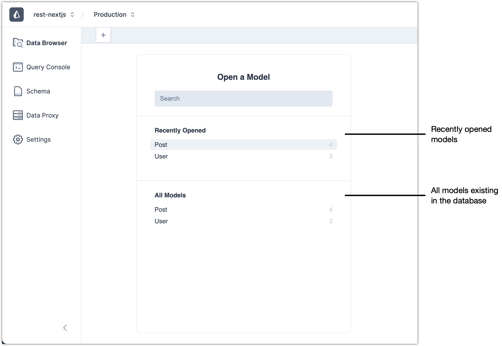
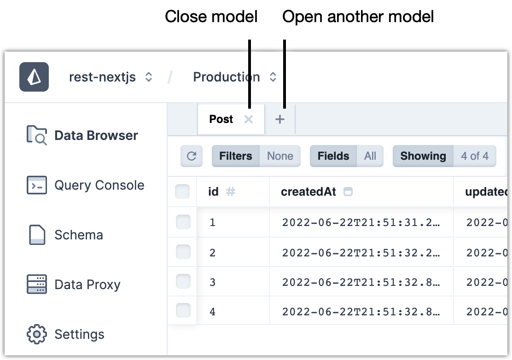
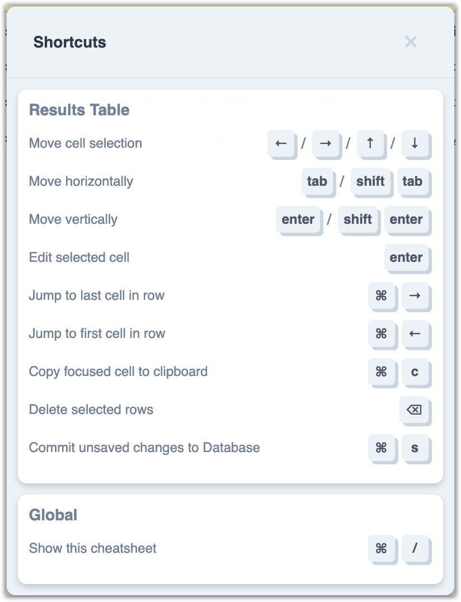
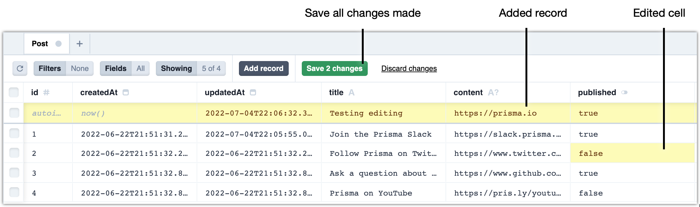
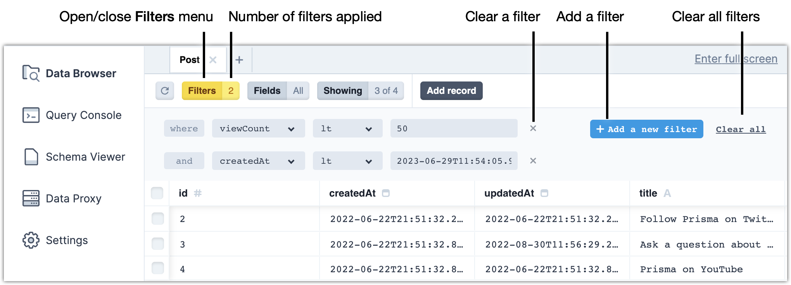
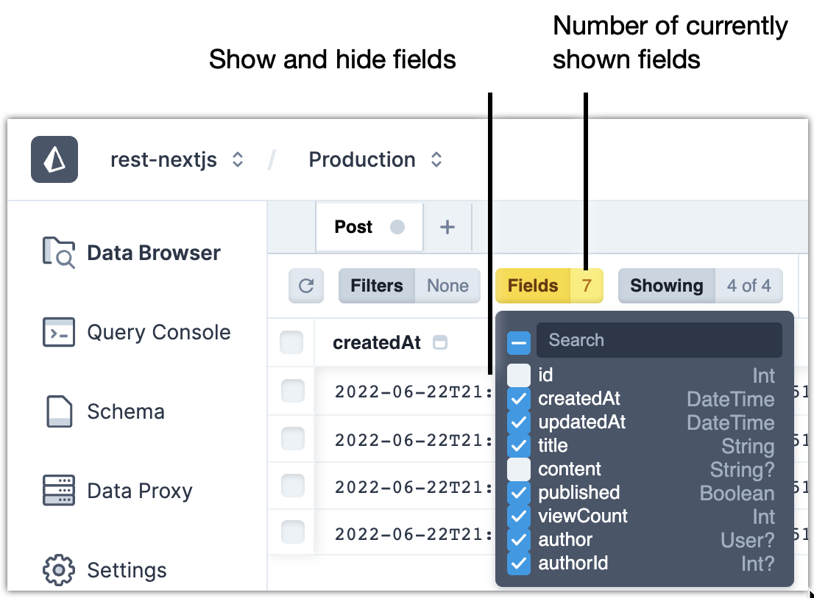
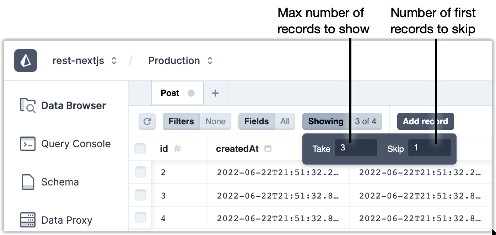
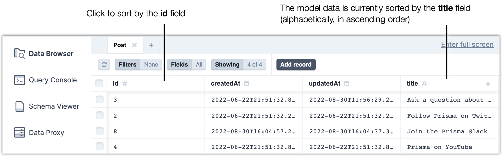

<TopBlock>

Use **Data Browser** in the Prisma Data Platform to view and edit your application data.

</TopBlock>

## Models (tables or collections)

When you first open **Data Browser**, you see a list of all models defined in your Prisma schema file.

<Admonition>

**What is a model?**  

The term **model** refers to the data model definitions that you add to the Prisma schema file. Depending on the database that you use, a model definition, such as `model User`, refers to a **table** in a relational database (PostgreSQL, MySQL, SQL Server, SQLite, CockroachDB) or a **collection** in MongoDB.  
For more information, see [Defining models](/concepts/components/prisma-schema/data-model#defining-models).

</Admonition>

You can select a model and its data opens in a new tab.

### Open and close models

To open another model, click the **+** button.

To close a model, click the the **x** button in the model tab.

### Icons of data types in models

The data type for each field is indicated with an icon in the header.

The table below lists all data types and their identifying icon.

|                                Field data type                                 | Description                                                                                                 |
| :----------------------------------------------------------------------------: | ----------------------------------------------------------------------------------------------------------- |
|      | Text                                                                                                        |
|      | Integer                                                                                                     |
|  | Date-time                                                                                         |
|    | Boolean                                                                                                |
|          | Pre-defined list of values (`enum` data type)                                                               |
|        | List of related records from another model                                                                  |
|      | The `{}` symbol can refer to one of the two types of fields.   • Relation field • JSON field |

### Keyboard shortcuts in models

When you open a model, a number of keyboard shortcuts are available to browse and manipulate the data in the model.

<Admonition>

**Note**  
With **Data Browser** open, you can open the keyboard shortcuts modal by pressing <kbd>Cmd &#8984;</kbd>+<kbd>/</kbd> on macOS or <kbd>Ctrl</kbd>+<kbd>/</kbd> on Windows.

</Admonition>

## Edit data

In the model view, you can edit data directly in the model cells. You can copy and paste values in cells. You can add new records as well as delete existing records.

You must confirm every edit operation (add, edit, or delete). You confirm added and edited records with the **Save change** button. When you select records and click **Delete records**, you confirm the deletion in a dialog box.

You can accumulate multiple added records and edited cells, which you can then finalize with the **Save changes** button.

You can select multiple records and delete them at once with the **Delete records** button. When you delete multiple records, the operation completes immediately (after you confirm it).

In addition, if you have any accumulated added or edited records and then decide to delete records, the deletion also force-saves the accumulated edits.

You can discard any accumulated changes with the **Discard changes** button.

### Copy and paste

You can copy the value of any table cell using:

- <kbd>Cmd &#8984;</kbd> + <kbd>C</kbd>&nbsp;&nbsp;&nbsp;on macOS
- <kbd>Ctrl</kbd> + <kbd>C</kbd>&nbsp;&nbsp;&nbsp;&nbsp;&nbsp;on Windows

To paste in another cell, first double-click the cell to enter edit mode, and then use:

- <kbd>Cmd &#8984;</kbd> + <kbd>V</kbd>&nbsp;&nbsp;&nbsp;on macOS
- <kbd>Ctrl</kbd> + <kbd>V</kbd>&nbsp;&nbsp;&nbsp;&nbsp;&nbsp;on Windows

### Add a record

1. In the model view, click **Add record**.
2. Based on the data allowed in each field, type the data for the record.

   |                                Field data type                                 | Description                                                                                                                                                                                                                                                                                                                                                                                                                                                                                                                                                                |
   | :----------------------------------------------------------------------------: | -------------------------------------------------------------------------------------------------------------------------------------------------------------------------------------------------------------------------------------------------------------------------------------------------------------------------------------------------------------------------------------------------------------------------------------------------------------------------------------------------------------------------------------------------------------------------- |
   |      | Text                                                                                                                                                                                                                                                                                                                                                                                                                                                                                                                                                                       |
   |      | Integer  If such a field has `autoincrement()` pre-filled, do not edit the cell and do not add a number manually.                                                                                                                                                                                                                                                                                                                                                                                                                                                |
   |  | Date-time  Date-time fields contain a long string of numbers, letters, and others. As a best practice, copy the value of another date-time cell and modify it as necessary before pasting in the field.                                                                                                                                                                                                                                                                                                                                                          |
   |    | Boolean  Select `true` or `false`.                                                                                                                                                                                                                                                                                                                                                                                                                                                                                                                               |
   |          | Pre-defined list  Double-click a cell in the field and select one of the pre-defined options.                                                                                                                                                                                                                                                                                                                                                                                                                                                                    |
   |        | List of related records from another model  It typically refers to a list of records that exist in another model in the database. If you are adding a new record and records from the related model do not yet exist, you do not need to enter anything in the current model.                                                                                                                                                                                                                                                                                    |
   |      | The `{}` symbol can refer to one of the two types of fields.   • Relation field • JSON field  **Relation with a model defined separately in the database**  Typically, you need to select the same value as any of the previous records Click the name of the model to see the list of values which you can then select for the related field.  **JSON field**   Double-click the field to edit the JSON data. As a best practice, validate the edited JSON data in a validator and paste it back in the cell. |

3. (Optional) If you are unhappy with your changes, click **Discard changes** and start over.
4. Click **Save 1 change**.

### Edit a record

1. Double-click a cell with existing data to edit.
2. (Optional) If you are unhappy with your changes, click **Discard changes** and start over.
3. Click **Save 1 change**.

### Delete a record

1. From the left column, select the check box for the record you want to delete.
2. Click **Delete 1 record**.
3. Click **Delete** in the confirmation dialog.

### Edit multiple records at once

You can add multiple records, edit multiple cells and, thus, accumulate multiple edits.

In the end, click **Save changes** to finalize them.

<Admonition type="warning">

**Warning**  
Deleting a record is a separate operation that cannot be accumulated. If you delete a record while having unsaved edits, the delete operation first force-saves the unsaved edits and then completes.

</Admonition>

## Filters

### Filter data

Use the **Filters** menu to filter data in the model by adding conditions.

In the **Filters** menu, the first condition that you add is the `where` clause.

When you add multiple conditions, **Data Browser** filters the results so that all conditions apply in combination. Each new condition indicates this with the `and` operator, which appears in front.

**Steps**

1. Click **Filters** to open the **Filters** menu.

   <Admonition>

   **Note**  
   Click **Filters** again if you want to hide the menu.

   </Admonition>

2. Click **Add a new filter**.
3. Configure the condition.
   1. Select the field by which you want to filter.
   2. Select a comparison operator.
      - **equals**
      - **in**
      - **notin**
      - **lt**
      - **lte**
      - **gt**
      - **gte**
      - **not**
   3. Type the value you want to use for the condition. 
      **Step result**: **Data Browser** updates the data in the model immediately, based on the condition.
4. To add a new filter, click **Add a new filter** and repeat the steps above.
5. To remove a filter, click the **x** button on the right.
   
6. To remove all filters, click **Clear all**.

**Result**

- The data in the model is filtered based on the combination of all conditions you add.
- In the **Filters** menu, the default value of **None** changes to display the number of filters you add.

### Show and hide fields

You can select which fields to view or hide by using the **Fields** menu.

<Admonition>

**What is a field?**  

A **field** is a property of a model which you add in the data model definitions in the Prisma schema file. Depending on the database that you use, a field, such as the `title` field in `model User { title String }`, refers to a **column** in a relational database (PostgreSQL, MySQL, SQL Server, SQLite, CockroachDB) or a **document field** in MongoDB.  
For more information, see [Defining fields](/concepts/components/prisma-schema/data-model#defining-fields).

</Admonition>

**Steps**

1. Click the **Fields** menu.
2. Select only the fields you want to see and deselect any fields you want to hide.
   

**Result**

The model is immediately filtered to hide the data from any fields you have deselected.

Also, the **Fields** menu shows the number of fields that are currently selected.

### Show and hide records

You can also select to show or skip a specific number of records in the model view.

<Admonition>

**What is a record?**  

A **record** refers to a **row of data in a table** in a relational database (PostgreSQL, MySQL, SQL Server, SQLite, CockroachDB) or a **document** in MongoDB.

</Admonition>

**Steps**

1. Click the **Showing** menu.
2. In the **Take** box, specify the maximum number of records that you want the model view to show.
3. In the **Skip** box, specify how many of the first records you want to hide.
   

**Result**

The model is immediately filtered to show or hide records based on your selection.

The **Showing** menu indicates how many records are shown out of how many available records are in the model.

## Sort data

Click a field title to sort by the field data.

The first click sorts the data in ascending order, the second - in descending order.

## Limitations

The response size when loading data on the Data Browser is limited to 4MB. If the size of the data requested exceeds 4MB, you will run into Prisma Client Error on the Data Browser.
