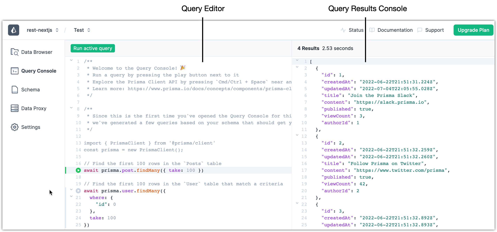
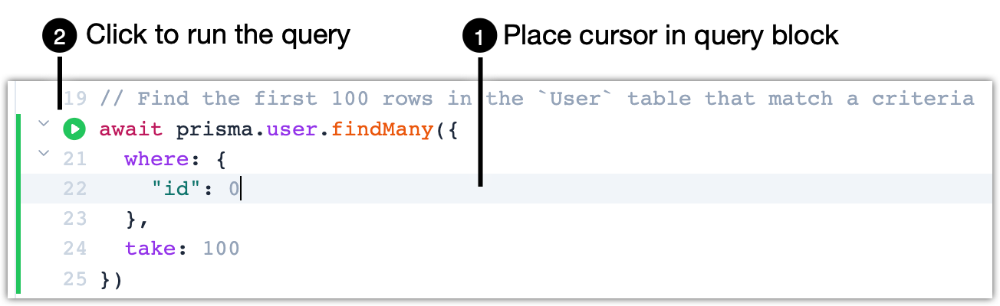
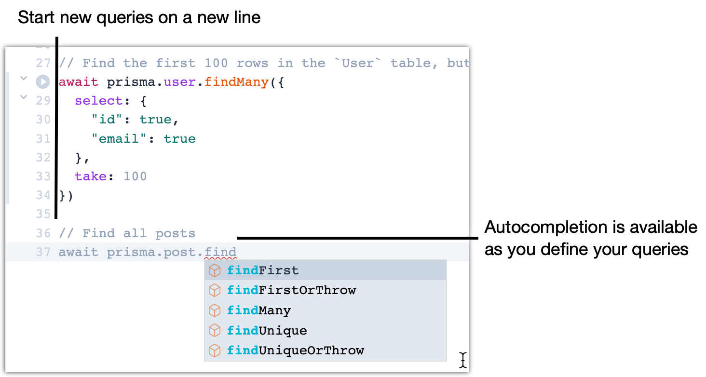

<TopBlock>

Use Query Console to run the 3 pre-defined `findMany()` test queries or add and test queries of your own using the [Prisma Client API for model queries](/reference/api-reference/prisma-client-reference#model-queries).

</TopBlock>

## UI components

Query Console is comprised of 2 major UI components - **Query Editor** and **Query Results Console**.

| UI component          | Description                                                                         |
| --------------------- | ----------------------------------------------------------------------------------- |
| Query Editor          | • Add, edit, delete queries using the Prisma Client API • Run a selected query |
| Query Results Console | View the results from the selected query                                            |

## Default model queries

The default queries available in Query Console use the `findMany()` method and are based on a model defined in the Prisma schema file.

<Admonition>

**Note**  
The model queries listed below are from an example application that has the `User` model.

</Admonition>

- `findMany()` for the first 100 records in the `User` model
- `findMany()` for the first 100 records in the `User` model that match a criteria
- `findMany()` for the first 100 records in the `User` model but only return data from 2 fields

## Run a query

You can test and run queries for your app using Prisma Client from Query Console and view their results on the right side of the screen.

**Steps**

1. In the Query Editor, place the cursor anywhere in a query block.
2. Run the query using one of the 3 available methods.
   - Click the **Run active query** button in the upper-left.
   - Click the **Play** (**Run query**) button at the left margin of the editor.
   - Press <kbd>Cmd</kbd> + <kbd>Enter</kbd> (on macOS) or <kbd>Ctrl</kbd> + <kbd>Enter</kbd> (on Windows).
     

**Result**

The query results appear in the right side in the Query Results Console.

## Add a query

When you add or edit existing queries, Query Console supports the same syntax highlighting and autocompletion features available with the Prisma extension in Visual Studio Code or other modern IDEs.

**Steps**

1. Add a new line at the end of an existing query.
2. Define your query. Autocomplete is available as you type the available Prisma models and query methods based on the generated Prisma Client for the app.
   

**What's next**

After you add a query, you can use the green button to test it.

## Limitations

The response size when loading data on the Query Console is limited to 4MB. If the size of the data requested exceeds 4MB, you will run into Prisma Client Error on the Query Console.
