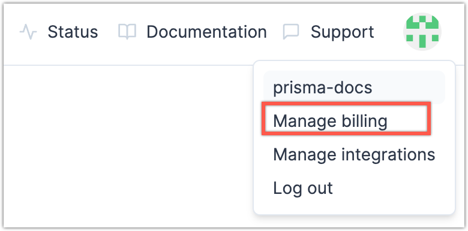
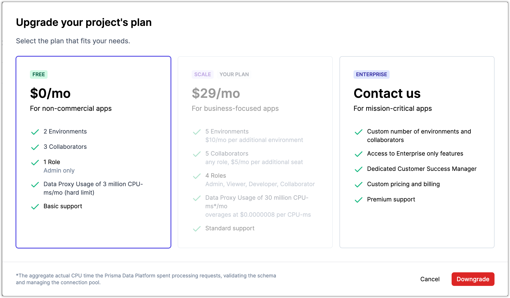
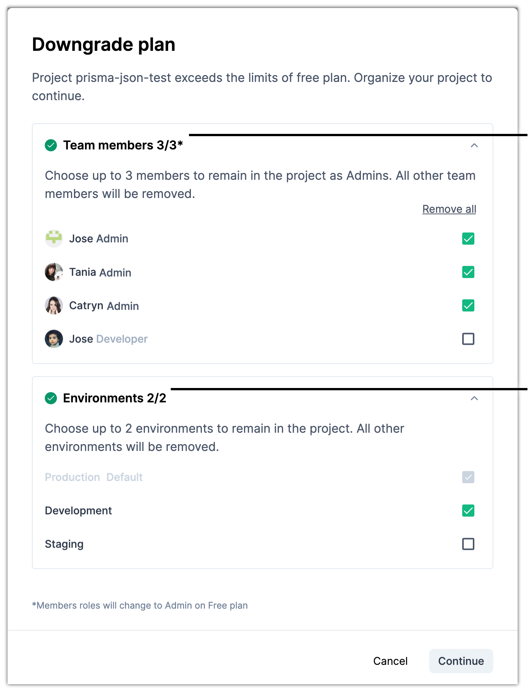

<TopBlock>

Each project you create in the Prisma Data Platform starts on the **Free** plan.

While the **Free** plan allows you to create your proof-of-concept or iterate on the first development phases of your Prisma project, it does so with a few limitations. Based on that, you might want to upgrade to a paid plan in a number of scenarios.

- You want to have more team members on your project than the **Free** plan allows.
- You need specific roles for team members (**Viewer**, **Developer**, **Collaborator**).
- You want to have more environments than the **Free** plan allows.
- You exceeded or are concerned about exceeding the Data Proxy usage quota in the **Free** plan.

<Admonition type="info">

**Available plans**  
See [Plans and quotas](/data-platform/billing/plans-and-quotas) for descriptions of all plans available in the Prisma Data Platform.

</Admonition>

</TopBlock>

## Considerations and prerequisites

Only project owners (creators) can upgrade a project to a paid plan.

## Upgrade to Scale plan

If you have a project in the Prisma Data Platform that is currently on the **Free** plan, and you want to increase the quota of environments, team members, and the Data Proxy CPU usage, you can do so by upgrading to the **Scale** plan.

**Steps**

1. Go to the [_Billing_](https://cloud.prisma.io/billing) page or click your profile icon and select **Manage billing**.

   

2. Click **Manage plan** for the project you want to upgrade.
3. Select the **Scale** plan and click **Review Details**.
4. Click **Pay Now and Upgrade**.

**Result**

Your project is now upgraded to the **Scale** plan.

## Upgrade to Enterprise plan

An **Enterprise** plan can be custom-made and allows teams of all sizes to establish the number of environments and collaborators needed, as well as benefit from a custom amount of Data Proxy CPU usage that makes the most sense for a Prisma project.

**Steps**

1. Go to the [_Billing_](https://cloud.prisma.io/billing) page or click your profile icon and select **Manage billing**.

   

2. Click **Manage plan** for a project you want to upgrade.
3. Select the **Enterprise** plan and click **Contact Sales**.

**Result**

You are redirected to chat with a representative.

We are eager to learn what is the best Prisma Data Platform usage that will help you develop a successful project with Prisma.

## Downgrade to Free plan

If the **Scale** plan no longer makes sense for a project, you can downgrade the project to the **Free** plan.

<Admonition>

**Note**:  

If you need to downgrade a project that is on the **Enterprise** plan, [contact Support](/data-platform/contact-support).

</Admonition>

Downgrading to the **Free** plan includes a number of changes to your project.

- If you have more team members or environments than are included in the quota on the **Free** plan, you must reduce the number of existing team members or environments.
- The Data Proxy CPU usage changes to the hard limit included with the **Free** plan.
- All team members receive the Admin role. The roles Viewer, Collaborator, and Developer are not available on the **Free** plan.

When you downgrade a project to the **Free** plan, we will issue a refund for the remaining time until the end of the month for which you still have unused overages on extra team members or environments.

For example, if on the **Scale** plan you have one extra member the overage for which you have pre-paid at the beginning of the month, for the remainder of the current month on that overage we will give you a refund.

If your project has Data Proxy CPU milliseconds overages until the downgrade, the invoice for your next month will include the charges for those.

**Prerequisites**

Learn about the [**Free** plan](/data-platform/billing/plans-and-quotas#strongfreestrong-plan) and the quotas that it includes for team members, environments, and Data Proxy CPU usage.

**Steps**

1. Go to the _[Billing](https://cloud.prisma.io/billing)_ page or click your profile icon and select **Manage billing**.

   

2. Under _Your projects_, click **Manage plan** for the project that you want to downgrade.
3. Select the **Free** plan and click **Downgrade**.

   

4. Click **Confirm downgrade** if the number of collaborators or environments on your project does not exceed the quotas on the [**Free** plan](/data-platform/billing/plans-and-quotas#strongfreestrong-plan).
5. If on your project you have more collaborators or environments than are included in the quotas on the [**Free** plan](/data-platform/billing/plans-and-quotas#strongfreestrong-plan), decide how to handle each overage.

   1. Expand _Team members and_ select the allowed number of team members you want to keep on the project.
   2. Expand _Environments_ and do the same for the environments you want to keep on the project.

      <Admonition>

      **Note**  

      You cannot delete the default environment for a project.  

      If you want to delete the default environment, you must first assign one
      of the other environments as the default.

      </Admonition>

6. Click **Continue**.

   

7. Review the downgrade summary and click **Confirm downgrade**.

**Result**

A confirmation message indicates if your plan is successfully downgraded and the browser redirects to the _[Billing](https://cloud.prisma.io/billing)_ page.

If you see an error message for an unsuccessful downgrade, [contact Support](/data-platform/contact-support).
