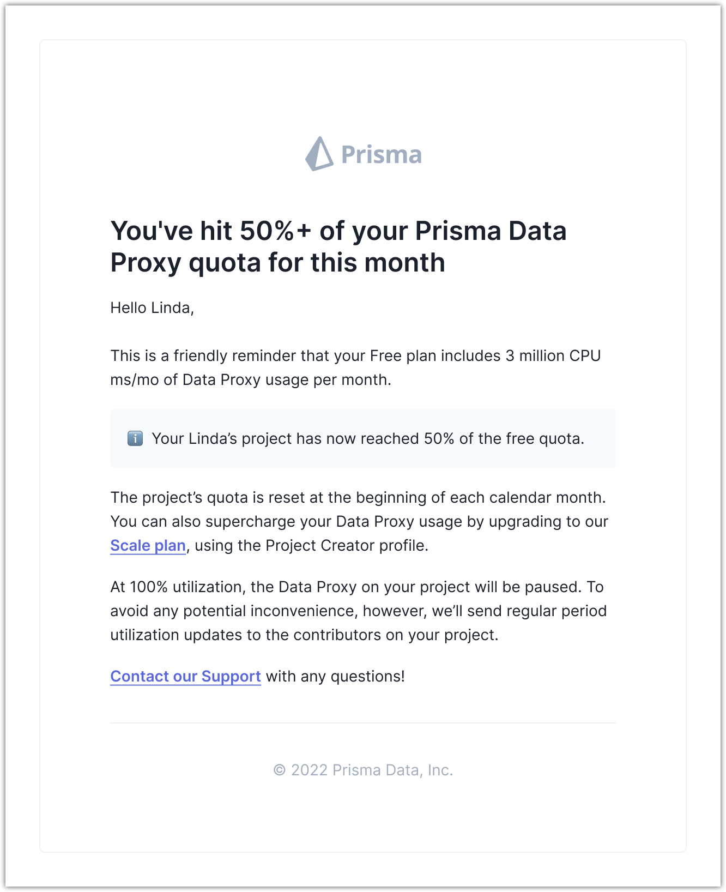

<TopBlock>

Prisma Data Platform continuously monitors the Data Proxy usage of your projects and sends automated notifications to the email address of your GitHub account when your project reaches usage milestones.

</TopBlock>

## Milestones that trigger notifications

Prisma Data Platform sends automated email notifications based on your project plan and the amount of Data Proxy usage you accumulate during any given month.

- [Free plan](/data-platform/billing/plans-and-quotas#strongfreestrong-plan)
  - Notifications at 50%, 75%, and 90% of Data Proxy usage from the included quota
  - Notification for Data Proxy pause at 100% of Data Proxy usage from the included quota
- [Scale plan](/data-platform/billing/plans-and-quotas#strongscalestrong-plan)
  - Notification at 90% of Data Proxy usage from the included quota
  - Notification for overages at 100% of Data Proxy usage from the included quota

Below you can see an example of an email notification when the Data Proxy usage reaches 50% on the Free plan.

## Weekly notification of accrued overages

When you start accruing overages during the month, Prisma Data Platform sends weekly email notifications summarizing the amount of overages over the past week.
