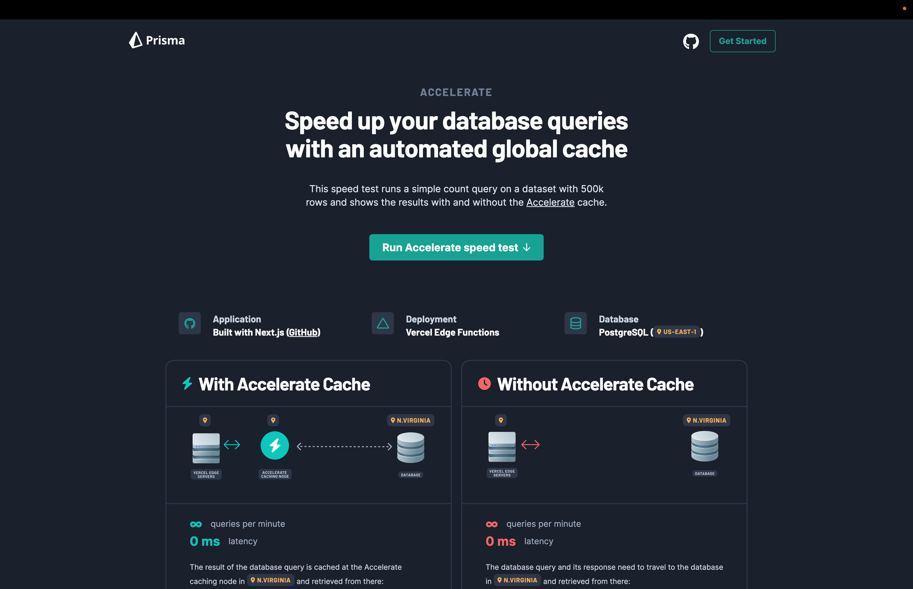

<TopBlock>

[Accelerate](https://www.prisma.io/data-platform/accelerate) is a global database cache available in 300 locations that you can use to achieve up to 1000x faster database queries.

Its main features are:

- a global cache
- scalable connection pool for serverless and edge applications
- usage of Prisma Client at the edge (e.g. in Cloudflare Workers or Vercel Edge Functions)

The goal of Accelerate is to improve response times and reduce database load. It works by caching data at the edge using established caching patterns that you control.

While Accelerate is beneficial for all types of applications, being at the edge provides additional benefits to edge function environments like [Vercel Edge Functions](https://vercel.com/docs/concepts/functions/edge-functions), [Cloudflare Workers](https://workers.cloudflare.com/), and [Deno Deploy](https://deno.com/deploy). Cache hits can be served from data centers near the user regardless of the region of the database.

</TopBlock>

## See Accelerate in action

We built a small sample application, [Accelerate Speed Test](https://accelerate-speed-test.prisma.io/). The app compares the performance of cached and uncached queries side by side. The app is [open source](https://github.com/prisma/accelerate-speed-test) and you can clone it to try it yourself.

